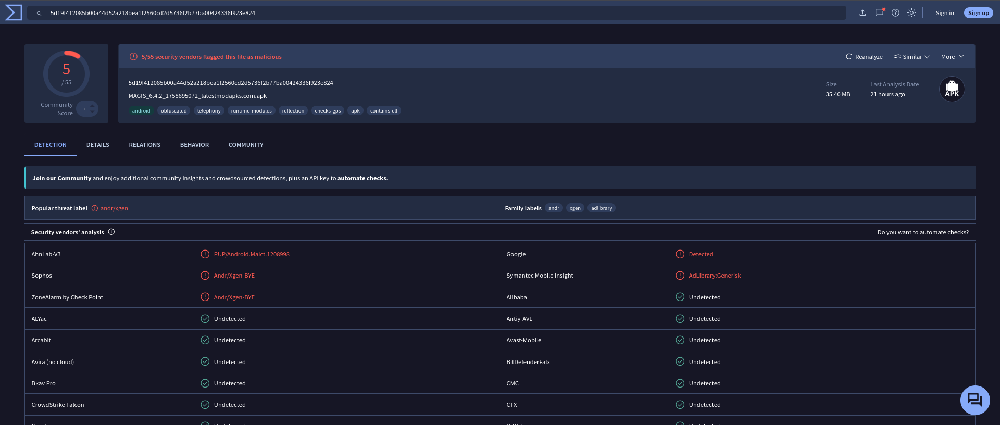

# 01 — Triage Inicial

## Objetivo de esta fase

Antes de ejecutar o desempaquetar la muestra, se realiza un triage rápido
basado en su huella criptográfica (hash) para determinar si es una amenaza
conocida, sin necesidad de análisis manual profundo.

## Obtención de la muestra

```bash
mkdir -p ~/analisis_magis && cd ~/analisis_magis
wget -O magistv.apk https://magistvapks.com.co/download/
file magistv.apk
```

Resultado de `file`: `Android package (APK), with gradle app-metadata.properties`
— confirma que el archivo descargado es un APK válido y no una página de error.

## Cálculo del hash SHA-256

```bash
sha256sum magistv.apk
```

```
5d19f412085b00a44d52a218bea1f2560cd2d5736f2b77ba00424336f923e824  magistv.apk
```

El hash es el identificador único de esta muestra específica. Se utiliza para
consultar bases de datos de inteligencia de amenazas sin necesidad de exponer
o compartir el binario.

## Consulta en VirusTotal

**Nombre real detectado por VT:** `MAGIS_6.4.2_1758895072_latestmodapks.com.apk`
(el propio nombre del archivo delata su origen: un repositorio de APKs
modificados, no la tienda oficial).

**Resultado:** 5 / 55 motores antivirus la marcan como maliciosa / no deseada.

| Motor | Veredicto |
|---|---|
| AhnLab-V3 | `PUP/Android.Malct.1208998` |
| Sophos | `Andr/Xgen-BYE` |
| ZoneAlarm (Check Point) | `Andr/Xgen-BYE` |
| Symantec Mobile Insight | `AdLibrary:Generisk` |
| Google (Play Protect) | Detected |

**Etiqueta popular de amenaza:** `andr/xgen`
**Family labels:** `andr`, `xgen`, `adlibrary`

**Tags automáticos de VirusTotal:** `obfuscated`, `runtime-modules`,
`reflection`, `checks-gps`, `contains-elf`



## Interpretación (Triage)

- La detección no es masiva (5/55), lo cual es típico de **adware / PUP**
  (Potentially Unwanted Program) más que de malware destructivo — no implica
  que sea inofensiva, solo que su comportamiento es más "gris" (publicidad
  agresiva, recolección de datos) que directamente destructivo.
- El veredicto de **Symantec (`AdLibrary:Generisk`)** sugiere la presencia de
  una librería de publicidad de terceros embebida en la app.
- Los tags **`obfuscated`** y **`reflection`** indican que el desarrollador
  intencionalmente dificultó la ingeniería inversa del código — comportamiento
  común en apps que buscan ocultar lógica maliciosa o no autorizada.
- El tag **`contains-elf`** indica presencia de binarios nativos (`.so`),
  que se ejecutan fuera del bytecode Java/Kotlin estándar y son más difíciles
  de inspeccionar — punto de atención para el análisis estático.
- **`checks-gps`** indica que la app solicita o consulta la ubicación del
  dispositivo, algo a verificar contra los permisos declarados en el
  siguiente documento.

**Hipótesis de trabajo para el análisis estático:** confirmar la presencia de
la librería de adware, identificar el uso de reflexión/ofuscación en el
código descompilado, y revisar si los permisos declarados exceden lo
necesario para una app de streaming.

Siguiente: [`02-analisis-estatico.md`](02-analisis-estatico.md)
